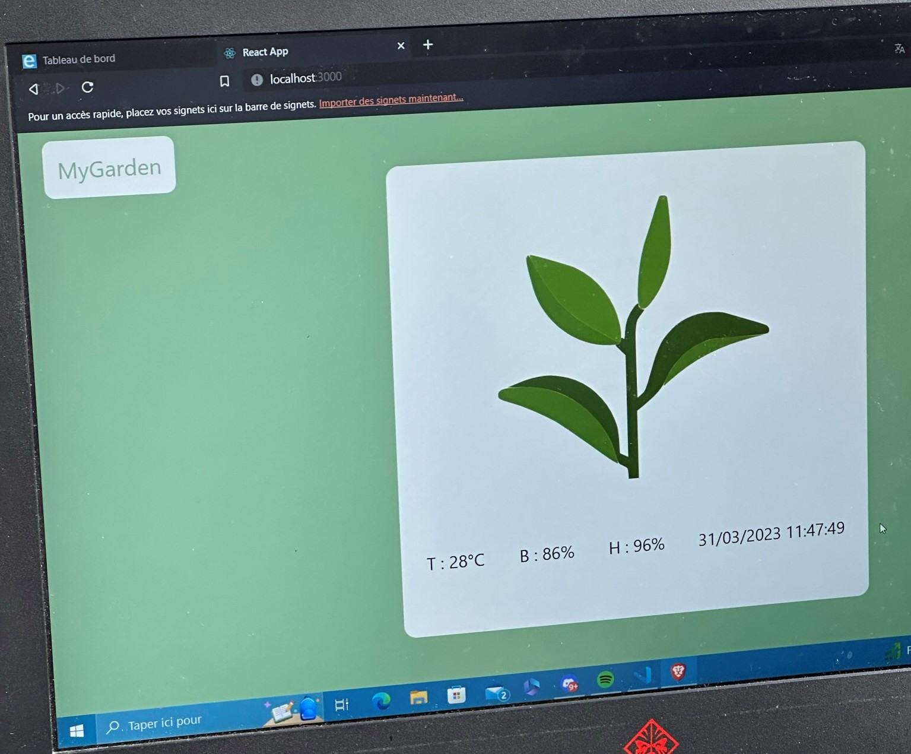
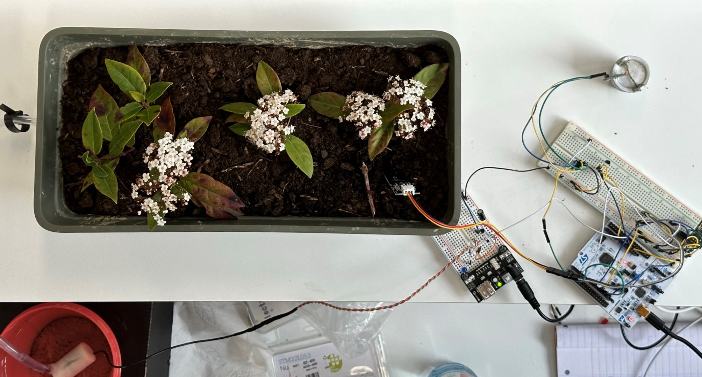
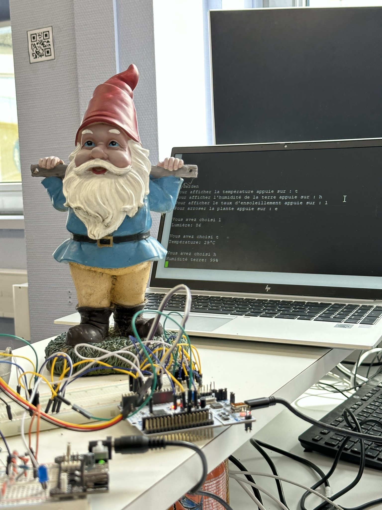
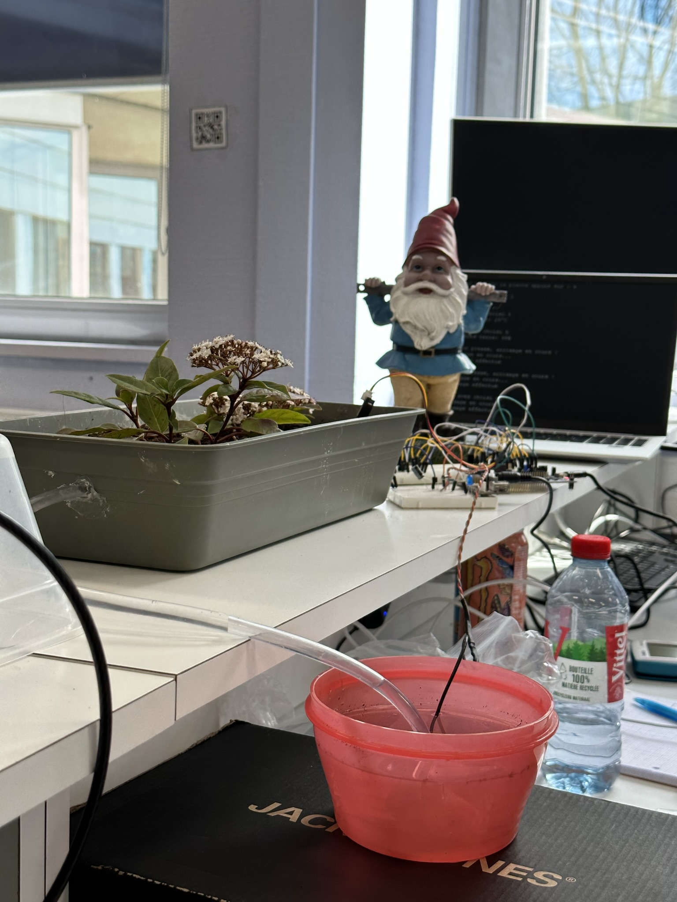

**Choose your language:**  

  
  
  

# The Plant App

This project was carried out during the third year of my engineering program in work-study format (3A FISA – 2022–2023) at ESIEA, Laval campus, in collaboration with Jonas CHOLET.

When we learned that we would have to do an electronics project, I immediately thought of creating a connected flower pot, as I often faced this problem with my own plants. Since I am away from my apartment during the week due to my work-study schedule, my plants are left unwatered.

The goal was to create a prototype that could monitor the plant's health using data such as soil moisture, room temperature, and light exposure. Additionally, it should allow for remote watering. "Remote" here implies an interconnection with a web interface, requiring Wi-Fi connectivity and a webpage to display this data.

To achieve this, Jonas and I developed a web page using NodeJS and Express for the API part, and ReactJS for the frontend interface.  

For communication between the board and the API, we used the MQTT protocol. We set up an MQTT broker (Mosquitto) on a hosted Linux server.  

We prepared all of this ahead of our lab week, which focused solely on using the STM32 board and various sensors. The web interface and Wi-Fi communication were considered extras and were not a major part of the grading criteria.

During the lab week, we had to connect all the sensors to the board. Here's the hardware used:

| Name | Purpose | Type | Description |
|------|---------|------|-------------|
| **STM32 Nucleo-L053R8** | Main board | Microcontroller | Core of the prototype |
| **ESP8266 ESP01** | Wi-Fi module | Digital | Provides Wi-Fi connectivity. It was configured with the code in the [ESP8266](ESP8266/) folder. We used UART1 for serial communication with the STM32 |
| **TMP36** | Temperature sensor | Analog | Outputs 500mV at 0°C; for every 10mV, the temperature increases by 1°C |
| **Moisture Sensor v2.0** | Soil moisture sensor | Analog | Outputs moisture levels based on preset thresholds |
| **Photoresistor** | Light sensor | Analog | Voltage increases with light intensity and decreases with darkness |
| **Submersible Pump 3-5V** | Waters the plant | Digital | Controlled via a transistor on a separate circuit to avoid interference with the main board |

  

We were also required to implement serial console communication through the STM32's UART port. We built a simple system that retrieves temperature, soil moisture, sunlight level, and allows manual watering.

The project was completed on time and was about 90% functional. We were not able to receive MQTT messages on the STM32 due to UART reception issues. Despite this, the teacher gave us a grade of 18/20 in recognition of the work and dedication we put into the project.

Here are a few pictures of the final project:

  
