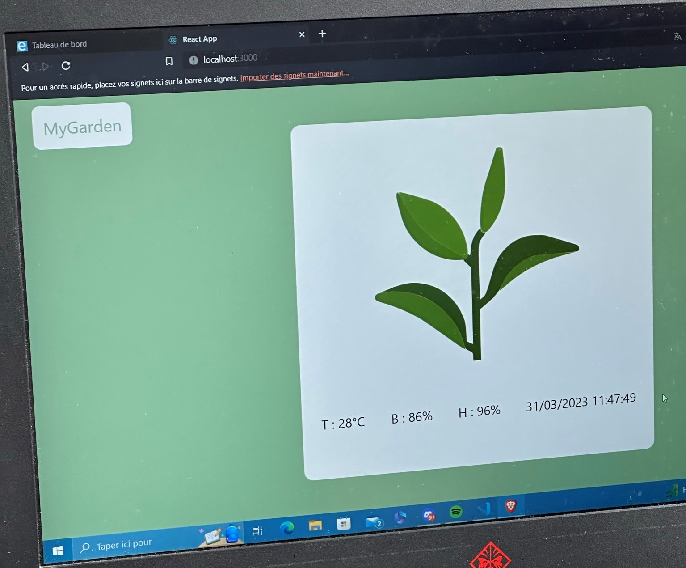
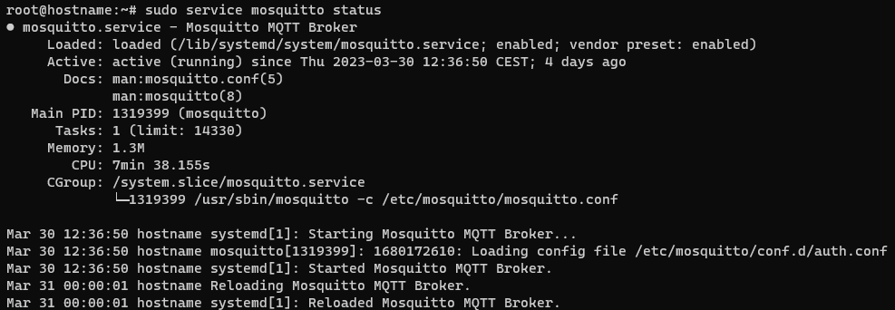
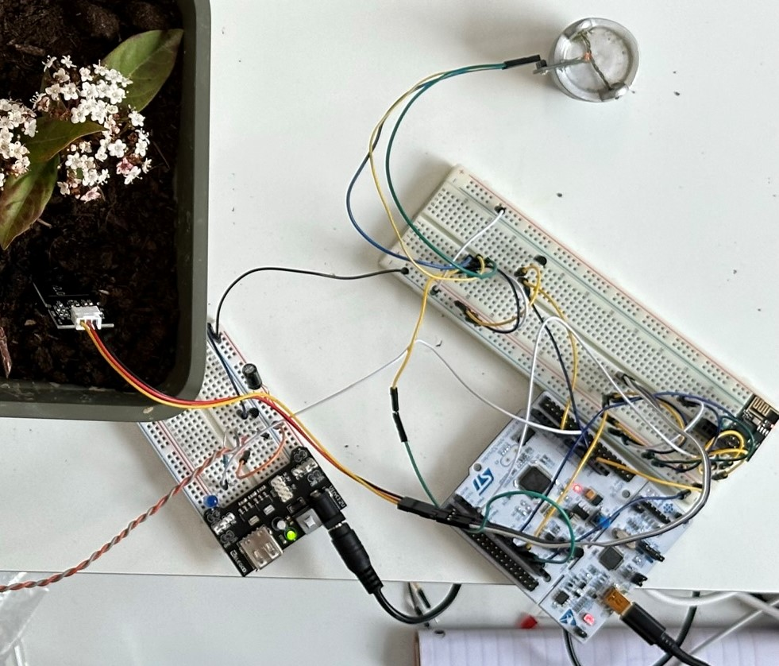
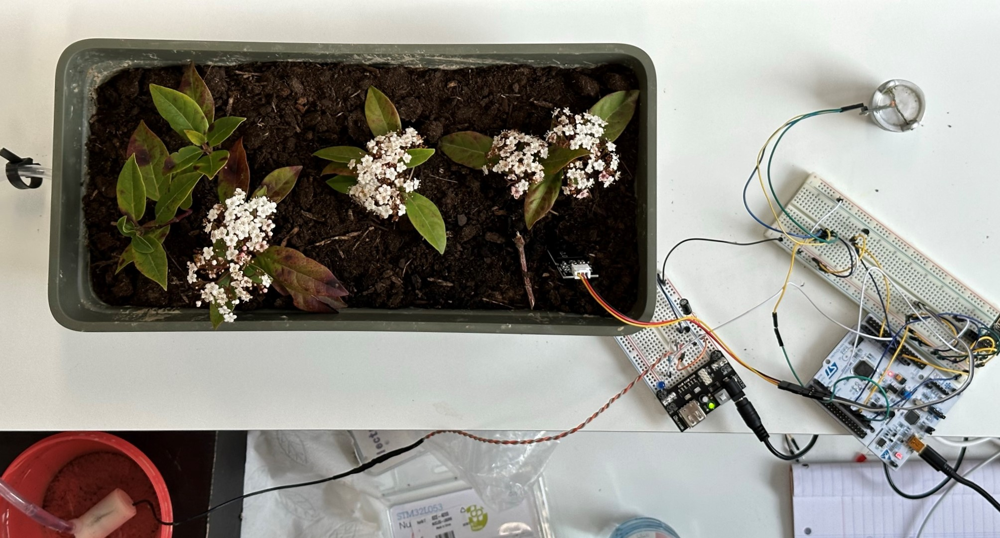
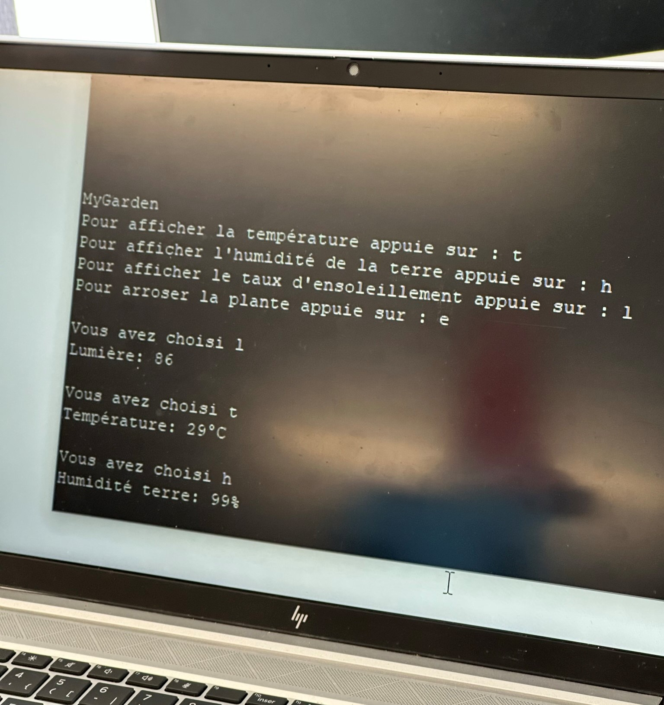
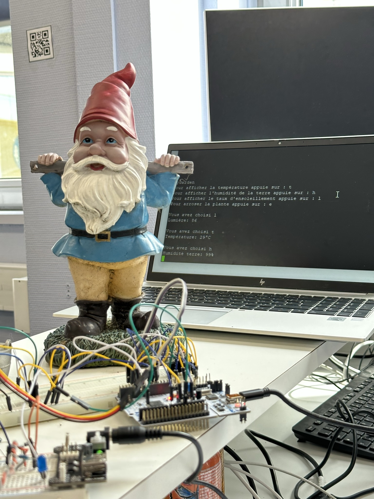
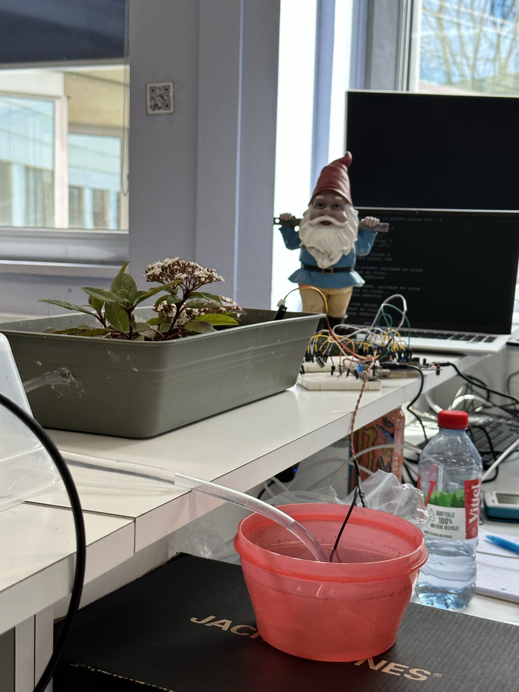

**Choose your language:**  

  
  
  

# The Plant App

Este proyecto fue realizado durante el tercer año del programa de ingeniería en alternancia (3A FISA - 2022-2023) en ESIEA, Campus de Laval, en colaboración con Jonas CHOLET.

Cuando supimos que teníamos que realizar un proyecto de electrónica, inmediatamente se me ocurrió la idea de hacer una maceta conectada, ya que yo mismo tenía este problema con mis plantas. Al estar en alternancia, cuando no estoy en mi apartamento, mis plantas no pueden ser regadas.

El objetivo era crear un prototipo capaz de verificar el estado de salud de la planta mediante la humedad del suelo, la temperatura del ambiente y la cantidad de luz solar recibida. Además, debía ser posible activar el riego a distancia. "A distancia" significa que era necesaria una conexión con una interfaz web, por lo tanto, necesitábamos una conexión WiFi en el sistema y una página web que recuperara esta información.

Para lograr este objetivo, Jonas y yo desarrollamos una página web con NodeJS y Express para la API, y NodeJS con ReactJS para la interfaz de usuario.

En cuanto a la comunicación entre la placa y la API, decidimos usar el protocolo MQTT, por lo que implementamos un broker MQTT (Mosquitto) en un servidor Linux alojado.

Preparamos todo esto antes de la semana de laboratorio (TP), que se centraba exclusivamente en el uso de la tarjeta STM32 y varios sensores. Toda la parte de interfaz web y comunicación WiFi era un extra y no contaba mucho para la calificación.

Durante esa semana de TP, conectamos todos los sensores a la tarjeta:

| Nombre | Función | Tipo | Información |
|--------|---------|------|-------------|
| **STM32 Nucleo-L053R8** | Placa base | Microcontrolador | Placa principal del prototipo |
| **ESP8266 ESP01** | Módulo WiFi | Digital | Este módulo permite la conexión WiFi. Fue configurado con el código presente en [ESP8266](ESP8266/) y para comunicarse con el STM32 usamos comunicación serie mediante el puerto UART1 |
| **TMP36** | Sensor de temperatura | Analógico | Este sensor devuelve 500mV a 0°C y la temperatura aumenta 1°C por cada 10mV adicionales |
| **Moisture Sensor v2.0** | Sensor de humedad del suelo | Analógico | Este sensor devuelve la humedad del suelo en niveles escalonados |
| **Fotorresistencia** | Detecta la luminosidad | Analógico | El voltaje en sus terminales aumenta cuando hay más luz y disminuye cuando hay menos |
| **Bomba sumergible 3-5V** | Riega la planta | Digital | Este motor es activado por un transistor en un circuito adicional, ya que la irradiación afecta al circuito principal |

En este TP, se requería comunicación mediante consola a través del puerto serie del STM32. Implementamos un sistema sencillo que permite recuperar la temperatura, la humedad del suelo, la luminosidad, y activar el riego.

El proyecto fue terminado a tiempo y entregado con un 90% de funcionalidad. No logramos recibir correctamente las publicaciones MQTT en el STM32, la recepción vía UART fue problemática.

A pesar de esto, el profesor nos otorgó una calificación de **18/20** en vista del trabajo y la implicación demostrada.

Aquí algunas fotos del proyecto finalizado:

