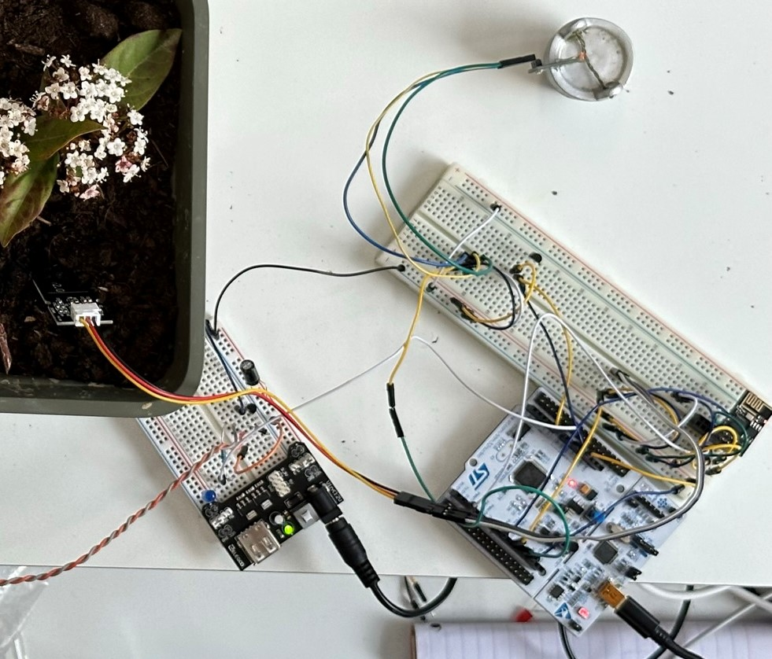
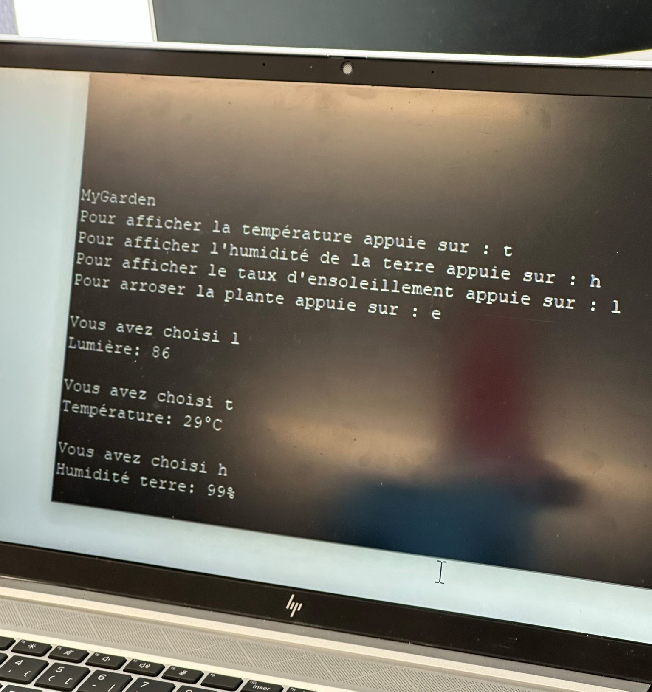

**Choose your language:**  

  
  
  

# The Plant App
Ce projet a été réalisé en troisième année de formation d'ingénieur par alternance (3A FISA - 2022-2023) à l'ESIEA Campus de Laval en groupe avec Jonas CHOLET.

Lorsque nous avons appris que nous devrions faire un projet d'électronique, j'ai tout de suite eu l'idée de faire un pot de fleurs connecté, car j'avais cette problématique avec mes plantes. Étant en alternance lorsque je ne suis pas à mon appartement mes plantes ne peuvent être arrosée.
L'objectif était de pouvoir créer un prototype permettant de vérifier l'état de santé de la plante avec le taux d'humidité de la terre, la température de la pièce ainsi que le taux d'ensoleillement. De plus, il devait être possible de réaliser un arrosage à distance. "À distance", veux dire qu'il fallait une interconnexion avec une interface web, il fallait donc une connexion wifi sur le et une page web récupérant ces infos.

Pour atteindre cet objectif, nous avons alors, avec Jonas, réalisé une page web avec NodeJS et express pour la partie API et NodeJS avec ReactJS pour la partie interface.

Concernant la communication entre la carte et l'api, nous avons choisi d'utiliser le protocole MQTT, on a donc mis en place un broker MQTT (Mosquitto) sur une serveur Linux herbergé.

Nous avons préparé tout cela en amont de notre semaine de TP qui portait uniquement sur l'utilisation de la carte STM32 et de différents capteurs, toute la partie interface web et communication WIFI n'était qu'un plus et ne serais que peu pris en compte pour la notation.

Lors de cette fameuse semaine de TP, il a fallu connecter tous les capteurs à la carte, nous avons donc :
| Nom | Rôle | Type | Informations |
|-----|------|------|--------------|
| **STM32 Nucleo-L053R8** | Carte mère | Micro-contrôleur | Carte principale de ce prototype |
| **ESP8266 ESP01** | Module wifi | Numérique | Ce module permet la connexion wifi, il a été configuré avec le code présent dans [ESP8266](ESP8266/) et pour parler avec le STM32, nous avons utilisé la communication série par le port UART1 |
| **TMP36** | Capteur de température | Analogique | Ce capteur retourne 500mV à 0°C et tous les 10mV la température augment de 1°C |
| **Moisture Sensor v2.0** | Capteur d'humidité de la terre | Analogique | Ce capteur retourne l'humidité de la terre selon des paliers |
| **Photorésistance** | Donne la luminosité | Analogique | La tension à la borne de cette résistance augmente si la luminosité augmente et diminue si la luminosité diminue. |
| **Pompe Submersible 3-5V** | Arroser la plante | Numérique | Ce moteur est actionné par un transistor sur un circuit annexe, car le rayonnement affecte le circuit principal |

Il était demandé dans ce TP d'avoir une communication dans une console par le port série du STM32. Nous avons donc mis en place un système simple permettant de récupérer la température, l'humidité de la terre, le taux d'ensoleillement et permettre l'arrosage.

Ce projet aura été terminé à temps et rendu 90% fonctionnel, en effet nous n'avons pas réussi à réceptionner sur le STM32 les publications MQTT, la communication uart en réception nous a posé problème.
L'enseignant nous à tout de même attribué la note de 18/20 au regard du travail et de l'implication fournie.

Voici quelques photos du projet fini.

